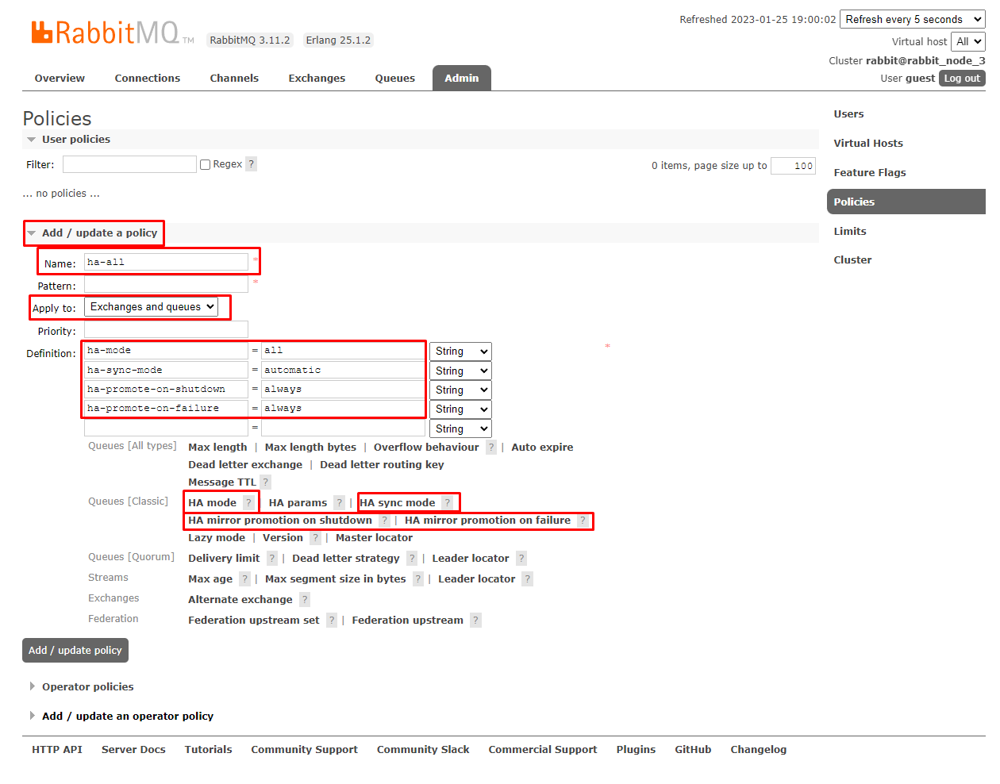

# Python x RabbitMQ failover cluster in Docker
Implementing a simple RabbitMQ failover cluster with load balancer HAProxy in Docker

If the commands below are planned to be executed from an external terminal, then you need to execute them in the following format: ```docker exec -it <container_name> <command>```

---

## Deployment
Run command ```docker-compose up -d```

---

## Deployment errors
In case of errors with ```docker-compose up -d```, containers will have to be deployed using the ```docker-compose --file=docker-composed.yml up -d``` and execute the commands below **manually for each slave node** (see below):

---

## Joining a node to a cluster

**Connect** slave nodes to master node (automated by **docker-compose** with **entrypoint.sh**):
* ```rabbitmqctl stop_app```
* ```rabbitmqctl reset```
* ```rabbitmqctl join_cluster rabbit@rabbit_node_1```
* ```rabbitmqctl start_app```

Check the **status of the cluster nodes** using one of the following methods:
* **monitoring interface of HAProxy**: ```http://localhost:8100/```
* **rabbitmq monitoring interface**: ```http://localhost:15672/```
* any **node's terminal**: ```rabbitmqctl cluster_status```

---

## Testing:

1. **create local venv**: ```python -m venv venv```

2. **install dependencies**: ```python -m pip install -r requirements.txt```

3. **run module** ```init_rmq.py``` to create broker infrastructure (if it was not created by the RabbitMQ web interface) 

4. Set up a **high-availability policy** for all exchanges and queues:  


5. Run ```consumer.py``` and ```producer.py``` and experiment with the cluster by turning off and on its different nodes.

---

## Links:

* [Practice and testing](https://www.youtube.com/watch?v=1UfVZVr39Cg&list=WL&index=16&t=3s&ab_channel=Unixway)

* [Manual RMQ cluster deploy](https://www.youtube.com/watch?v=vWLbvVPMfqk&list=WL&index=17&ab_channel=bigtown2012)

* [Deploy RMQ cluster in Docker](https://www.youtube.com/watch?v=FzqjtU2x6YA&list=WL&index=26&t=2s&ab_channel=ThatDevOpsGuy)


